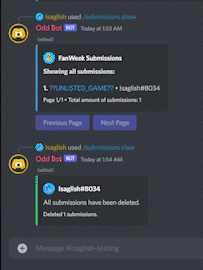

# Odd Bot <!-- omit in toc -->

A personal project made for the Fanweek event discord server.

## Note <!-- omit in toc -->
I don't intend on making Odd Bot a public bot that can be used by anyone as I don't find any reason to do so. It's not like everyone has a Fancade related server that could use Odd Bot, plus there is not a lot of unique features I can provide and there are lots of bots out there that already does most stuff for you.

However, this source is provided to give you an idea on how I created Odd Bot and probably help you on developing your own.

## Table of Contents <!-- omit in toc -->

- [Features](#features)
  - [Text Commands](#text-commands)
  - [Slash Commands](#slash-commands)
    - [Submissions](#submissions)
  - [Context Menus](#context-menus)
- [Issues](#issues)
- [Links](#links)

## Features

### Text Commands

| Command                    | Description                                             | Permissions |
| -------------------------- | ------------------------------------------------------- | ----------- |
| **`ob.source`**            | Returns the link to this repository                     | `None`      |
| **`ob.help`**              | Returns a link to the Features section of this README   | `None`      |
| **`ob.sync `**             | Syncs all app commands to the `config['test_guild_id']` | `Bot Owner` |
| **`ob.jsk : ob.jishaku `** | Jishaku extension for testing and debugging.            | `Bot Owner` |

### Slash Commands

Parameters inside `<parameter>` are required.

Parameters inside `[default: value]` are optional.

#### Submissions

| Command                                               | Description                                | Permissions                                                                    |
| ----------------------------------------------------- | ------------------------------------------ | ------------------------------------------------------------------------------ |
| **`/submissions submit <link> [member: None] `**      | Saves your submission into the database.   | accessing **`[member: None]`** requires `Manage Server`                        |
| **`/submissions unsubmit <link>`**                    | Removes your submission from the database. | un-submitting another member's submission requires `Manage Server`             |
| **`/submissions show [member: None] [all: False] `**  | Shows all of your submissions.             | `None`                                                                         |
| **`/submissions clear [member: None] [all: False] `** | Clears all of your submissions.            | accessing **`[member: None]`** and **`[all: False]`** requires `Manage Server` |

### Context Menus

| Name        | Description                                 |
| ----------- | ------------------------------------------- |
| Report User | Sends you a form to fill out for reporting. |

## Issues
If you find any bugs, issues, or unexpected behavior while using the bot, you should open an issue with details of the problem and how to reproduce if possible. Please also open an issue for any new features or commands you would like to see added.
    
## Links
- **License:** [MIT](https://github.com/Isaglish/fanweek-oddbot/blob/main/LICENSE)
- **Repository:** [GitHub](https://github.com/Isaglish/fanweek-oddbot)